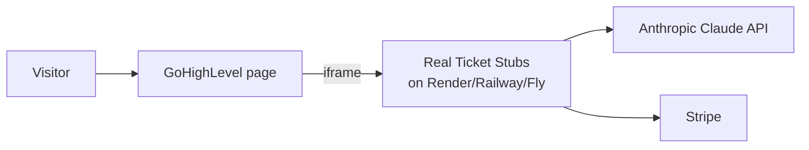

# Deploying Real Ticket Stubs (with GoHighLevel)

This app has **two parts**:

1. A **frontend** (`index.html`, `app.js`, `styles.css`, `ticket.css`, plus browser modules).
2. A **Node.js backend** (`server.mjs`) that powers `/api/extract` (Claude), Payment Links, `/api/stripe/webhook` (Stripe), and address verification.

> ⚠️ **Important — read this first:** GoHighLevel is a website/funnel/CRM builder. It can host **static pages and custom HTML/embeds**, but it **cannot run a Node.js server**. So the backend (`server.mjs`) must be hosted on a Node host (Render, Railway, Fly.io, a VPS, etc.). GoHighLevel then displays the app — the simplest, most reliable way is to **embed the deployed app in an iframe**.

---

## Recommended setup: host the full app on a Node host, embed in GoHighLevel

This keeps the frontend and backend on the **same origin** (inside the iframe), so there's no CORS to manage and Stripe redirects work cleanly.



### Step 1 — Deploy the backend (example: Render)

1. Push this repo to GitHub (there's a helper: `./scripts/push-to-github.sh`).
2. Create a **New → Web Service** at [render.com](https://render.com) and connect the repo.
3. Settings:
   - **Runtime:** Node
   - **Build command:** `npm install`
   - **Start command:** `npm start`
   - **Node version:** 20.12 or newer (set via the `engines` field — already in `package.json`).
4. Add the environment variables (see the table below) under **Environment**.
5. Deploy. You'll get a public HTTPS URL like `https://real-ticket-stubs.onrender.com`.
6. Verify it's healthy: open `https://YOUR-APP.onrender.com/healthz` — you should see `{"status":"ok",...}`.

> Railway and Fly.io work the same way: connect the repo, set env vars, start with `npm start`.

### Step 2 — Set environment variables

| Variable | Required | Value |
|----------|----------|-------|
| `ANTHROPIC_API_KEY` | Yes (for AI extract) | `sk-ant-...` from [console.anthropic.com/settings/keys](https://console.anthropic.com/settings/keys) |
| `STRIPE_PAYMENT_LINK_MAIL` | Yes (Payment Links) | `https://buy.stripe.com/...` for $3.99 mailed stub |
| `STRIPE_PAYMENT_LINK_FRAMED` | Yes (Payment Links) | `https://buy.stripe.com/...` for $29.99 framed stub |
| `STRIPE_WEBHOOK_SECRET` | Yes (before fulfilling orders) | `whsec_...` (Step 4) |
| `STRIPE_SECRET_KEY` | Optional | Only for API Checkout fallback or webhook session retrieval |
| `NODE_ENV` | Yes | `production` (enables HSTS) |
| `FRAME_ANCESTORS` | Yes for GHL embed | Your GoHighLevel domain(s), e.g. `https://app.yourbrand.com` (space-separated for multiple) |
| `ALLOWED_ORIGINS` | Only for split hosting | Leave empty for the iframe setup |
| `PORT` | No | Most hosts set this automatically |
| `ANTHROPIC_VISION_MODEL` | No | Default `claude-sonnet-4-6`. Use `claude-haiku-4-5` to cut cost |

> `FRAME_ANCESTORS` must include your GHL domain or the browser will refuse to display the iframe. Find your domain in GoHighLevel under **Sites → Domains**.

### Step 3 — Embed in GoHighLevel

1. In GoHighLevel, open the **Funnel/Website builder** and edit the page.
2. Add a **Custom Code / Custom HTML** element (full-width section).
3. Paste this, replacing the `src` with your deployed URL:

```html
<div style="position:relative;width:100%;min-height:1200px;">
  <iframe
    src="https://YOUR-APP.onrender.com/"
    title="Real Ticket Stubs"
    style="position:absolute;inset:0;width:100%;height:100%;border:0;"
    allow="clipboard-write"
    referrerpolicy="strict-origin-when-cross-origin"
    loading="lazy"
  ></iframe>
</div>
```

4. Save and publish. Visitors use the app inside your GoHighLevel page; uploads, AI extraction, and Stripe checkout all run on your backend.

### Step 4 — Configure the Stripe webhook (required before going live)

The webhook is how you **trust that a payment really succeeded** (never fulfill based on the browser redirect alone).

1. In the [Stripe Dashboard](https://dashboard.stripe.com/webhooks) → **Developers → Webhooks → Add endpoint**.
2. Endpoint URL: `https://YOUR-APP.onrender.com/api/stripe/webhook`
3. Events to send: **`checkout.session.completed`**.
4. Copy the **Signing secret** (`whsec_...`) and set it as `STRIPE_WEBHOOK_SECRET` on your host, then redeploy.
5. Implement fulfillment inside the `checkout.session.completed` handler in `server.mjs` (save the order, submit the print job, send the confirmation email).

Local testing:

```bash
stripe listen --forward-to localhost:3456/api/stripe/webhook
# copy the printed whsec_... into your .env, then trigger a test:
stripe trigger checkout.session.completed
```

---

## Alternative: frontend on GoHighLevel, backend elsewhere (advanced)

Only do this if you want the markup to live directly in GHL (no iframe). It requires CORS.

1. Deploy the backend as above. Note its URL, e.g. `https://api.yourbrand.com`.
2. On the host, set `ALLOWED_ORIGINS` to your **GoHighLevel page origin**, e.g. `https://app.yourbrand.com`.
3. In the GHL custom code block, set the API base **before** loading `app.js`:

```html
<script>window.RTS_CONFIG = { apiBase: "https://api.yourbrand.com" };</script>
```

4. Copy the contents of `index.html` (the `<main>` + modal markup) and the `<script>`/`<link>` tags into the GHL block, pointing the asset URLs at your backend (e.g. `https://api.yourbrand.com/app.js`).

> Caveat: with split hosting, Stripe's success redirect returns to the **backend** origin, not the GHL page. The iframe approach above avoids this entirely — prefer it unless you have a specific reason not to.

---

## Security hardening that's already built in

| Protection | How |
|-----------|-----|
| **No source/secret disclosure** | Static server uses a strict **allowlist**; `/.env`, `/server.mjs`, etc. return 404 |
| **DoS via huge uploads** | Request body size caps (8 MB images; 64 KB JSON) |
| **Slowloris** | `requestTimeout` / `headersTimeout` set |
| **Abuse / cost-bombing** | Per-IP **rate limiting** on every API route (429 + `Retry-After`) |
| **Clickjacking / XSS** | `Content-Security-Policy`, `frame-ancestors`, `X-Content-Type-Options`, escaped template output |
| **HTTPS enforcement** | `Strict-Transport-Security` (when `NODE_ENV=production`) + `upgrade-insecure-requests` |
| **CORS** | Closed by default; opt-in per origin via `ALLOWED_ORIGINS` |
| **Payment integrity** | Stripe **webhook signature verification**; address re-validated server-side before checkout |
| **No SQL injection** | No SQL database; if you add one, use parameterized queries only |

### What you still need for real DDoS protection

Application-level rate limiting stops casual abuse, but **volumetric (network-layer) DDoS** must be absorbed *before* it reaches your server. Put a CDN/WAF in front:

1. Point your domain's DNS at **Cloudflare** (free tier is fine to start).
2. Enable **proxy (orange cloud)**, **Bot Fight Mode**, and a **rate-limiting rule** on `/api/*`.
3. Optionally turn on **"Under Attack" mode** during an incident.
4. Keep `TRUST_PROXY=true` (default) so the app reads the real client IP from `X-Forwarded-For`.

If you run **multiple instances**, move the in-memory rate limiter to **Redis** so limits are shared.

---

## Go-live checklist

- [ ] `ANTHROPIC_API_KEY`, Payment Link env vars, `STRIPE_WEBHOOK_SECRET`, `NODE_ENV=production`, `FRAME_ANCESTORS` set on the host
- [ ] `/healthz` returns `{"status":"ok","ai":true,"payments":true}`
- [ ] Stripe switched from **test** to **live** keys; a real test purchase succeeds end-to-end
- [ ] Webhook endpoint shows successful deliveries in the Stripe Dashboard
- [ ] Fulfillment + confirmation email implemented in the webhook handler
- [ ] App loads inside the GoHighLevel iframe (no `frame-ancestors`/CSP errors in the browser console)
- [ ] Cloudflare (or other WAF/CDN) in front of the backend domain
- [ ] Refund/terms/privacy links added to checkout (see `TODO.md` → Legal & product)
