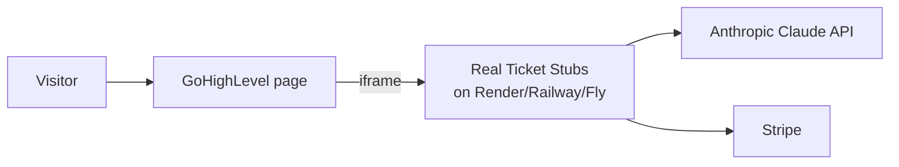

# Deploying Real Ticket Stubs (with GoHighLevel)

This app has **two parts**:

1. A **frontend** (`index.html`, `app.js`, `styles.css`, `ticket.css`, plus browser modules).
2. A **Node.js backend** (`server.mjs`) that powers `/api/extract` (Claude), Payment Links, `/api/stripe/webhook` (Stripe), and address verification.

> ⚠️ **Important — read this first:** GoHighLevel is a website/funnel/CRM builder. It can host **static pages and custom HTML/embeds**, but it **cannot run a Node.js server**. So the backend (`server.mjs`) must be hosted on a Node host (Render, Railway, Fly.io, a VPS, etc.). GoHighLevel then displays the app — the simplest, most reliable way is to **embed the deployed app in an iframe**.

---

## Recommended setup: host the full app on a Node host, embed in GoHighLevel

This keeps the frontend and backend on the **same origin** (inside the iframe), so there's no CORS to manage and Stripe redirects work cleanly.



### Step 1 — Deploy the backend (example: Render)

1. Push this repo to GitHub (there's a helper: `./scripts/push-to-github.sh`).
2. Create a **New → Web Service** at [render.com](https://render.com) and connect the repo.
3. Settings:
   - **Runtime:** Node
   - **Build command:** `npm install`
   - **Start command:** `npm start`
   - **Node version:** 20.12 or newer (set via the `engines` field — already in `package.json`).
4. Add the environment variables (see the table below) under **Environment**.
5. Deploy. You'll get a public HTTPS URL like `https://real-ticket-stubs.onrender.com`.
6. Verify it's healthy: open `https://YOUR-APP.onrender.com/healthz` — you should see `{"status":"ok",...}`.

> Railway and Fly.io work the same way: connect the repo, set env vars, start with `npm start`.

### Step 2 — Set environment variables

| Variable | Required | Value |
|----------|----------|-------|
| `ANTHROPIC_API_KEY` | Yes (for AI extract) | `sk-ant-...` from [console.anthropic.com/settings/keys](https://console.anthropic.com/settings/keys) |
| `STRIPE_PAYMENT_LINK_MAIL` | Yes (Payment Links) | `https://buy.stripe.com/...` for $3.99 mailed stub |
| `STRIPE_PAYMENT_LINK_FRAMED` | Yes (Payment Links) | `https://buy.stripe.com/...` for $29.99 framed stub |
| `STRIPE_WEBHOOK_SECRET` | Yes (before fulfilling orders) | `whsec_...` (Step 4) |
| `STRIPE_SECRET_KEY` | Recommended | Needed for the webhook to retrieve full order details (and API Checkout fallback) |
| `SUPABASE_URL` | Yes (to store orders) | Project URL, e.g. `https://abc.supabase.co` |
| `SUPABASE_SERVICE_ROLE_KEY` | Yes (to store orders) | **Service role** key — server-only secret |
| `RESEND_API_KEY` | Yes (to email customers) | From [resend.com](https://resend.com) |
| `ORDER_FROM_EMAIL` | Yes (to email customers) | Address on your Resend-verified domain |
| `SUPPORT_EMAIL` / `BUSINESS_NAME` | No | Shown in emails + legal pages |
| `GOOGLE_ADDRESS_VALIDATION_API_KEY` | No | Enables post-payment deliverability checks |
| `NODE_ENV` | Yes | `production` (enables HSTS) |
| `FRAME_ANCESTORS` | Yes for GHL embed | Your GoHighLevel domain(s), e.g. `https://app.yourbrand.com` (space-separated for multiple) |
| `ALLOWED_ORIGINS` | Only for split hosting | Leave empty for the iframe setup |
| `PORT` | No | Most hosts set this automatically |
| `ANTHROPIC_VISION_MODEL` | No | Default `claude-sonnet-4-6`. Use `claude-haiku-4-5` to cut cost |

> `FRAME_ANCESTORS` must include your GHL domain or the browser will refuse to display the iframe. Find your domain in GoHighLevel under **Sites → Domains**.

### Step 3 — Embed in GoHighLevel

1. In GoHighLevel, open the **Funnel/Website builder** and edit the page.
2. Add a **Custom Code / Custom HTML** element (full-width section).
3. Paste this, replacing the `src` with your deployed URL:

```html
<div style="position:relative;width:100%;min-height:1200px;">
  <iframe
    src="https://YOUR-APP.onrender.com/"
    title="Real Ticket Stubs"
    style="position:absolute;inset:0;width:100%;height:100%;border:0;"
    allow="clipboard-write"
    referrerpolicy="strict-origin-when-cross-origin"
    loading="lazy"
  ></iframe>
</div>
```

4. Save and publish. Visitors use the app inside your GoHighLevel page; uploads, AI extraction, and Stripe checkout all run on your backend.

### Step 4 — Configure the Stripe webhook (required before going live)

The webhook is how you **trust that a payment really succeeded** (never fulfill based on the browser redirect alone).

1. In the [Stripe Dashboard](https://dashboard.stripe.com/webhooks) → **Developers → Webhooks → Add endpoint**.
2. Endpoint URL: `https://YOUR-APP.onrender.com/api/stripe/webhook`
3. Events to send: **`checkout.session.completed`**.
4. Copy the **Signing secret** (`whsec_...`) and set it as `STRIPE_WEBHOOK_SECRET` on your host, then redeploy.
5. Implement fulfillment inside the `checkout.session.completed` handler in `server.mjs` (save the order, submit the print job, send the confirmation email).

Local testing:

```bash
stripe listen --forward-to localhost:3456/api/stripe/webhook
# copy the printed whsec_... into your .env, then trigger a test:
stripe trigger checkout.session.completed
```

---

## Alternative: frontend on GoHighLevel, backend elsewhere (advanced)

Only do this if you want the markup to live directly in GHL (no iframe). It requires CORS.

1. Deploy the backend as above. Note its URL, e.g. `https://api.yourbrand.com`.
2. On the host, set `ALLOWED_ORIGINS` to your **GoHighLevel page origin**, e.g. `https://app.yourbrand.com`.
3. In the GHL custom code block, set the API base **before** loading `app.js`:

```html
<script>window.RTS_CONFIG = { apiBase: "https://api.yourbrand.com" };</script>
```

4. Copy the contents of `index.html` (the `<main>` + modal markup) and the `<script>`/`<link>` tags into the GHL block, pointing the asset URLs at your backend (e.g. `https://api.yourbrand.com/app.js`).

> Caveat: with split hosting, Stripe's success redirect returns to the **backend** origin, not the GHL page. The iframe approach above avoids this entirely — prefer it unless you have a specific reason not to.

---

## Deploy to Vercel

This app is a single Node HTTP server (`server.mjs`) that also serves the static
frontend. Vercel's generic **Node server preset** detects a server that calls
`server.listen()` and routes *all* traffic to it, passing native
`IncomingMessage`/`ServerResponse` objects — so the security headers, static
allowlist, and the **raw-body Stripe webhook** all keep working unchanged.

### Steps

1. Push the repo to GitHub (already done).
2. In Vercel → **Add New… → Project** → import the repo.
3. **Framework Preset:** leave as **Other** (Vercel auto-detects the Node server
   from `server.mjs` + `npm start`). No `vercel.json` is required.
4. **Environment Variables** (Project → Settings → Environment Variables) — add
   the same keys from your `.env`, for the **Production** environment:
   - `ANTHROPIC_API_KEY`, `ANTHROPIC_VISION_MODEL`
   - `STRIPE_PAYMENT_LINK_MAIL`, `STRIPE_PAYMENT_LINK_FRAMED`
   - `STRIPE_SECRET_KEY`, `STRIPE_WEBHOOK_SECRET` (only if using API Checkout / webhook)
   - `GOOGLE_ADDRESS_VALIDATION_API_KEY` (optional)
   - `NODE_ENV=production`
   - `FRAME_ANCESTORS` (set to your GHL domain if embedding, else `'self'`)
   - Do **not** set `PORT` — Vercel assigns it.
5. **Raise the function timeout.** The Claude vision call (plus the seating
   retry) can exceed Vercel's **10 s default**. Go to Project → **Settings →
   Functions → Max Duration** and set it to **60 s** (the Hobby ceiling).
   > For a captured Node server you set this in the dashboard, *not* via
   > `vercel.json` `functions` (that key only applies to file-based `/api`
   > functions).
6. **Deploy.** Then verify `https://<your-app>.vercel.app/healthz` returns
   `{"status":"ok","ai":true,...}`.
7. **Stripe webhook:** in the Stripe Dashboard, set the endpoint URL to
   `https://<your-app>.vercel.app/api/stripe/webhook` and copy the new signing
   secret into `STRIPE_WEBHOOK_SECRET`, then redeploy.
8. **Custom domain:** Project → Settings → Domains → add `realticketstubs.com`
   and follow the DNS instructions (Vercel issues TLS automatically).

### Vercel-specific caveats

- **Rate limiting is per-instance.** The in-memory limiter resets on cold starts
  and isn't shared across concurrent serverless instances, so it's best-effort on
  Vercel. For real limits, back it with **Upstash Redis** (Vercel marketplace,
  free tier) or put **Cloudflare** in front (see below).
- **Cold starts** add ~0.3–1 s latency to the first request after idle.
- **Stateless only** — never write to local disk for anything you need to keep
  (orders, etc.); use a database (e.g. Supabase/Postgres).

> Prefer a persistent host (Render/Railway/Fly) if you want the in-memory rate
> limiter to actually hold and to avoid per-request timeout limits — the same
> `server.mjs` runs there unchanged. Vercel shines for the static frontend + a
> global edge network.

---

## Security hardening that's already built in

| Protection | How |
|-----------|-----|
| **No source/secret disclosure** | Static server uses a strict **allowlist**; `/.env`, `/server.mjs`, etc. return 404 |
| **DoS via huge uploads** | Request body size caps (8 MB images; 64 KB JSON) |
| **Slowloris** | `requestTimeout` / `headersTimeout` set |
| **Abuse / cost-bombing** | Per-IP **rate limiting** on every API route (429 + `Retry-After`) |
| **Clickjacking / XSS** | `Content-Security-Policy`, `frame-ancestors`, `X-Frame-Options` (when not embedding), `X-Content-Type-Options`, escaped template output |
| **Supply-chain (CDN tampering)** | CDN scripts pinned to exact versions with **Subresource Integrity** (`integrity` + `crossorigin`) |
| **HTTPS enforcement** | `Strict-Transport-Security` (when `NODE_ENV=production`) + `upgrade-insecure-requests` |
| **CORS** | Closed by default; opt-in per origin via `ALLOWED_ORIGINS` |
| **Open redirect** | Stripe links validated to `https://*.stripe.com` on both server and client |
| **Payment integrity** | Stripe **webhook signature verification**; address re-validated server-side before checkout |
| **No SQL injection** | No SQL database; if you add one, use parameterized queries only |

### What you still need for real DDoS protection

Application-level rate limiting stops casual abuse, but **volumetric (network-layer) DDoS** must be absorbed *before* it reaches your server. Put a CDN/WAF in front:

1. Point your domain's DNS at **Cloudflare** (free tier is fine to start).
2. Enable **proxy (orange cloud)**, **Bot Fight Mode**, and a **rate-limiting rule** on `/api/*`.
3. Optionally turn on **"Under Attack" mode** during an incident.
4. Keep `TRUST_PROXY=true` (default) so the app reads the real client IP from `X-Forwarded-For`.

If you run **multiple instances**, move the in-memory rate limiter to **Redis** so limits are shared.

---

## Order fulfillment (persistence + confirmation emails)

The Stripe webhook (`handleCheckoutCompleted`) now records each paid order and
emails the customer. Both integrations are **optional and env-gated** — without
them the app still runs and just logs. The startup banner shows their status.

### Order persistence — Supabase

1. Create a Supabase project, open **SQL Editor**, and run
   [`supabase/migrations/0001_orders.sql`](supabase/migrations/0001_orders.sql).
   It creates a locked-down `orders` table (RLS on, no public policies).
2. Set on the host:
   - `SUPABASE_URL` = your project URL (e.g. `https://abc.supabase.co`)
   - `SUPABASE_SERVICE_ROLE_KEY` = **service role** key (Settings → API). This is
     a server-only secret — never put it in the browser or in `.env.example`.
3. Writes are idempotent: `stripe_session_id` is `UNIQUE`, so a retried webhook
   won't create a duplicate order or re-send the email.

### Confirmation emails — Resend

1. Sign up at [resend.com](https://resend.com) → **Domains** → **Add Domain** →
   enter `realticketstubs.com`.
2. Resend shows DNS records (SPF, DKIM, etc.). Add them in your domain registrar
   (or Cloudflare DNS if you use it). Wait until Resend shows **Verified**.
3. **API Keys** → Create API Key → copy `re_...` into `.env` as `RESEND_API_KEY`.
4. Set on the host:
   - `ORDER_FROM_EMAIL=orders@realticketstubs.com`
   - `SUPPORT_EMAIL=support@realticketstubs.com`
   - `BUSINESS_NAME=Real Ticket Stubs`
5. Smoke-test without Stripe:

```bash
npm run test:fulfillment -- --email=you@yourinbox.com
```

You should see a row in Supabase **Table Editor → orders** and a confirmation
email in your inbox.

## Legal pages

`/terms.html`, `/privacy.html`, and `/refunds.html` are served and linked in the
footer. They are **templates** with `[bracketed placeholders]` — fill in your
legal business name + contact email and have them reviewed before going live.

## Go-live checklist

- [ ] `ANTHROPIC_API_KEY`, Payment Link env vars, `STRIPE_WEBHOOK_SECRET`, `NODE_ENV=production`, `FRAME_ANCESTORS` set on the host
- [ ] `SUPABASE_URL` + `SUPABASE_SERVICE_ROLE_KEY` set and migration run (orders persist)
- [ ] `RESEND_API_KEY` + `ORDER_FROM_EMAIL` set with a verified domain (emails send)
- [ ] `/healthz` returns `{"status":"ok","ai":true,...}`; startup banner shows persistence + email **ON**
- [ ] Stripe switched from **test** to **live** keys; a real test purchase succeeds end-to-end
- [ ] Webhook endpoint shows successful deliveries in the Stripe Dashboard; an order row appears + confirmation email arrives
- [ ] Legal page placeholders filled in (business name, support email) and reviewed
- [ ] App loads inside the GoHighLevel iframe (no `frame-ancestors`/CSP errors in the browser console)
- [ ] Cloudflare (or other WAF/CDN) in front of the backend domain (if not relying on Vercel's edge)
- [ ] Print-job submission to your fulfillment partner wired in (remaining `TODO` in the webhook)
