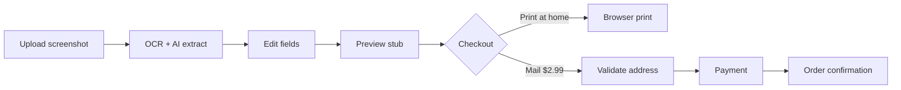

# Real Ticket Stubs

Turn a **mobile ticket screenshot** into a **print-ready Ticketmaster-style thermal stub** — for personal memorabilia. Upload, extract details, edit, then print at home or order a mailed stub.

> Not affiliated with Ticketmaster or Live Nation. For personal use only.

## Features

- **Upload** — PNG, JPG, or WEBP ticket screenshots
- **Extract** — Browser OCR (Tesseract) + server AI vision (OpenAI GPT-4o) in parallel; AI fills gaps in section / row / seat
- **Edit** — All stub fields: artist, venue, date, section, row, seat, barcode, etc.
- **Preview** — Vector Ticketmaster layout (1300×589) with perforation lines
- **Export** — Print, high-res PNG (3×), or SVG
- **Checkout** — Print at home (free) or **mail a printed stub for $2.99**
- **Address verification** — Email confirm + MX check + US/Canada postal validation before payment

## Quick start

```bash
git clone https://github.com/YOUR_USERNAME/real-ticket-stubs.git
cd real-ticket-stubs
cp .env.example .env
# Add OPENAI_API_KEY to .env for best extraction accuracy
npm start
```

### Publish to your GitHub account

From the project folder (requires [GitHub CLI](https://cli.github.com/) logged in):

```bash
chmod +x scripts/push-to-github.sh
./scripts/push-to-github.sh
```

Creates **`real-ticket-stubs`** on your account and pushes `main`. Use `./scripts/push-to-github.sh my-repo-name private` for a private repo.

Open [http://localhost:3456](http://localhost:3456).

## Environment variables

| Variable | Required | Description |
|----------|----------|-------------|
| `OPENAI_API_KEY` | Recommended | Server-side vision extract (`/api/extract`). Never exposed to the browser. |
| `OPENAI_VISION_MODEL` | No | Default `gpt-4o` |
| `PORT` | No | Default `3456` |
| `GOOGLE_ADDRESS_VALIDATION_API_KEY` | No | TODO: stricter deliverability checks |
| `USPS_USER_ID` | No | TODO: USPS address verification (US) |
| `STRIPE_SECRET_KEY` | No | TODO: real payments |

See [`.env.example`](.env.example).

## How it works



1. **Extract** — Client runs Tesseract; server runs OpenAI vision when `OPENAI_API_KEY` is set. Results are merged (vision wins; OCR fills blanks).
2. **Validate shipping** — `POST /api/validate-shipping` checks format, email MX records, and ZIP/city/state via [Zippopotam](https://zippopotam.us).
3. **Place order** — `POST /api/order` re-validates address, then logs the order (Stripe + fulfillment are TODO).

## Project structure

| File | Purpose |
|------|---------|
| `index.html` | UI, checkout modal, stub preview mount |
| `styles.css` | App theme (Ticketmaster blue / white) |
| `ticket.css` | Vector stub layout |
| `app.js` | Upload, extract, render, export, checkout |
| `templates.js` | Stub HTML generation + field derivation |
| `server.mjs` | Static server, `/api/extract`, `/api/validate-shipping`, `/api/order` |
| `shipping-validation.js` | Shared address/email rules (client + server) |
| `shipping-verify-server.mjs` | DNS MX + postal API (server only) |
| `TODO.md` | Production checklist |

## API endpoints

| Method | Path | Description |
|--------|------|-------------|
| `POST` | `/api/extract` | Vision JSON from ticket image (requires `OPENAI_API_KEY`) |
| `POST` | `/api/validate-shipping` | Verify email + mailing address |
| `POST` | `/api/order` | Place mailed stub order (mock payment today) |

## Production roadmap

See **[TODO.md](TODO.md)** for the full list (Stripe, fulfillment, Google/USPS address APIs, order emails, database, tests).

## Deployment notes

- Set `OPENAI_API_KEY` on the host; do not embed keys in the frontend.
- Run behind HTTPS (Caddy, nginx, or platform TLS).
- Payment is currently a **demo form** — integrate Stripe before accepting real cards.

## License

Private / unlicensed unless you add a `LICENSE` file.
