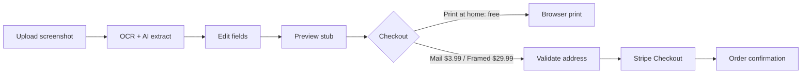

# Real Ticket Stubs

Turn a **mobile ticket screenshot** into a **print-ready Ticketmaster-style thermal stub** — for personal memorabilia. Upload, extract details, edit, then print at home or order a mailed stub.

> Not affiliated with Ticketmaster or Live Nation. For personal use only.

## Features

- **Upload** — PNG, JPG, or WEBP ticket screenshots
- **Extract** — Browser OCR (Tesseract) + server AI vision (Claude) in parallel; AI fills gaps in section / row / seat
- **Edit** — All stub fields: artist, venue, date, section, row, seat, barcode, etc.
- **Preview** — Vector Ticketmaster layout (1300×589) with perforation lines
- **Export** — Print, high-res PNG (3×), or SVG
- **Checkout** — Three options: **print at home (free)**, **mail a printed stub ($3.99)**, or a **framed stub for the wall ($29.99)**
- **Payments** — Real **Stripe-hosted Checkout** (falls back to mock mode if no key is set)
- **Address verification** — Email confirm + MX check + US/Canada postal validation before payment

## Quick start

**Run the Node server** — opening `index.html` as a file (`file://`) will not work (ES modules need HTTP).

```bash
cd realticketstubs
# Edit .env with your API keys (file is git-ignored)
npm start
```

Open **[http://localhost:3456](http://localhost:3456)**.

Port in use? `lsof -ti tcp:3456 | xargs kill -9` then `npm start` again.

### Clone from GitHub

```bash
git clone https://github.com/YOUR_USERNAME/real-ticket-stubs.git
cd real-ticket-stubs
# Create .env from the Environment variables table below
npm start
```

### Publish to your GitHub account

From the project folder (requires [GitHub CLI](https://cli.github.com/) logged in):

```bash
chmod +x scripts/push-to-github.sh
./scripts/push-to-github.sh
```

Creates **`real-ticket-stubs`** on your account and pushes `main`. Use `./scripts/push-to-github.sh my-repo-name private` for a private repo.

## Environment variables

| Variable | Required | Description |
|----------|----------|-------------|
| `ANTHROPIC_API_KEY` | Recommended | Server-side Claude vision extract (`/api/extract`). Never exposed to the browser. Get it at [console.anthropic.com/settings/keys](https://console.anthropic.com/settings/keys). |
| `ANTHROPIC_VISION_MODEL` | No | Default `claude-sonnet-4-6` |
| `STRIPE_PAYMENT_LINK_MAIL` | Recommended | Payment Link URL for mailed stub ($3.99). Set in `.env`, not in source code. |
| `STRIPE_PAYMENT_LINK_FRAMED` | Recommended | Payment Link URL for framed stub ($29.99). Set in `.env`, not in source code. |
| `STRIPE_SECRET_KEY` | Optional | API Checkout fallback + webhook session retrieval. Not needed if using Payment Links only. |
| `STRIPE_WEBHOOK_SECRET` | Before fulfillment | `whsec_...` — verifies `/api/stripe/webhook`. Required before fulfilling paid orders. |
| `NODE_ENV` | Prod | Set to `production` to enable HSTS and production defaults. |
| `FRAME_ANCESTORS` | For GHL embed | Origins allowed to iframe the app, e.g. your GoHighLevel domain. Default `'self'`. |
| `ALLOWED_ORIGINS` | Split hosting only | Comma-separated origins allowed via CORS. Empty = same-origin only. |
| `TRUST_PROXY` | No | `true` (default) when behind a proxy/load balancer; reads real client IP. |
| `PORT` | No | Default `3456` (most hosts set this automatically) |
| `GOOGLE_ADDRESS_VALIDATION_API_KEY` | No | TODO: stricter deliverability checks |
| `USPS_USER_ID` | No | TODO: USPS address verification (US) |

Copy the variables into a `.env` file in the project root (git-ignored). On deploy hosts, set the same names in the dashboard.

## How it works



1. **Extract** — Client runs Tesseract; server runs Claude vision when `ANTHROPIC_API_KEY` is set. Results are merged (vision wins; OCR fills blanks).
2. **Validate shipping** — `POST /api/validate-shipping` checks format, email MX records, and ZIP/city/state via [Zippopotam](https://zippopotam.us).
3. **Pay** — `POST /api/create-checkout-session` re-validates the address and creates a **Stripe-hosted Checkout** session; the browser is redirected to Stripe, then back to `/?checkout=success`.

## Project structure

| File | Purpose |
|------|---------|
| `index.html` | UI, checkout modal, stub preview mount |
| `styles.css` | App theme (Ticketmaster blue / white) |
| `ticket.css` | Vector stub layout |
| `app.js` | Upload, extract, render, export, checkout |
| `templates.js` | Stub HTML generation + field derivation |
| `server.mjs` | Static server, `/api/extract`, `/api/validate-shipping`, `/api/order` |
| `shipping-validation.js` | Shared address/email rules (client + server) |
| `shipping-verify-server.mjs` | DNS MX + postal API (server only) |
| `TODO.md` | Production checklist |

## API endpoints

| Method | Path | Description |
|--------|------|-------------|
| `GET` | `/api/config` | Public config (Payment Link URLs from env) |
| `GET` | `/healthz` | Health check (AI + payments status) for load balancers |
| `POST` | `/api/extract` | Vision JSON from ticket image (requires `ANTHROPIC_API_KEY`) |
| `POST` | `/api/validate-shipping` | Verify email + mailing address |
| `POST` | `/api/create-checkout-session` | Validate address + create a Stripe Checkout session (requires `STRIPE_SECRET_KEY`; mocks if unset) |
| `GET` | `/api/checkout-session?id=` | Look up a completed session for the success screen |
| `POST` | `/api/stripe/webhook` | Signature-verified Stripe events (`checkout.session.completed`) |

All API routes are per-IP rate-limited and body-size capped. See [`DEPLOYMENT.md`](DEPLOYMENT.md) for the full security model.

## Production roadmap

See **[TODO.md](TODO.md)** for the full list (Stripe, fulfillment, Google/USPS address APIs, order emails, database, tests).

## Deployment & hosting on GoHighLevel

See **[DEPLOYMENT.md](DEPLOYMENT.md)** for full step-by-step instructions, including how to host on GoHighLevel.

Short version:

- GoHighLevel **cannot run the Node backend** — deploy `server.mjs` to a Node host (Render, Railway, Fly.io, …), then **embed the app in GoHighLevel via an iframe**.
- Set `ANTHROPIC_API_KEY`, `STRIPE_WEBHOOK_SECRET`, `NODE_ENV=production`, `FRAME_ANCESTORS`, and Payment Link env vars on the host.
- Switch Stripe from `sk_test_...` to `sk_live_...` to go live, and confirm payments via the **webhook** before fulfilling.
- Put **Cloudflare (or another WAF/CDN)** in front for real DDoS protection.

## Security

Built-in protections: static-file **allowlist** (no source/secret disclosure), per-IP **rate limiting**, request **body-size caps**, **Slowloris** timeouts, **CSP** + `frame-ancestors` + HSTS + other headers, opt-in **CORS** allowlist, Stripe **webhook signature verification**, and HTML-escaped stub output. There is no SQL database, so there is no SQL-injection surface. Details and the production checklist live in [`DEPLOYMENT.md`](DEPLOYMENT.md) and [`TODO.md`](TODO.md).

## License

Private / unlicensed unless you add a `LICENSE` file.
